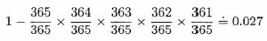

# **Birthday**
## Objective

- Assuming that there are 365 days in a year and that the probability that a person will be born on a given day is 1/365, we can calculate the probability that, in a group of five people chosen at random, at least two will have the same birthday, as follows:

- We start by calculating the probability that all five have different birthdays. This will be

- 

- The reasoning here is that the first person could be born on any of 365 days; the second person, to have a different birthday, could only be born on 364 out of 365 days; the third person, to have a birthday different from either of the first two, could only be born on 363 out of 365 days; and so on to the fifth person. Now, to find the probability that at least two people in a randomly chosen group of five have the same birthday, we simply subtract the above expression from 1 to obtain.

- 

- Write a program that produces a table showing the minimum number of people that would be required so that the probability of at least two people in a randomly chosen group having the same birthday is at least 0.1,0.2, ... ,0.9,1.0

---

- Has In.java
- Used Java version 1.2 ~~(*is updated though*)~~

  

***Made on September 14th, 2023***\
***By: Aaron Prince Anu***

*Temporary?*